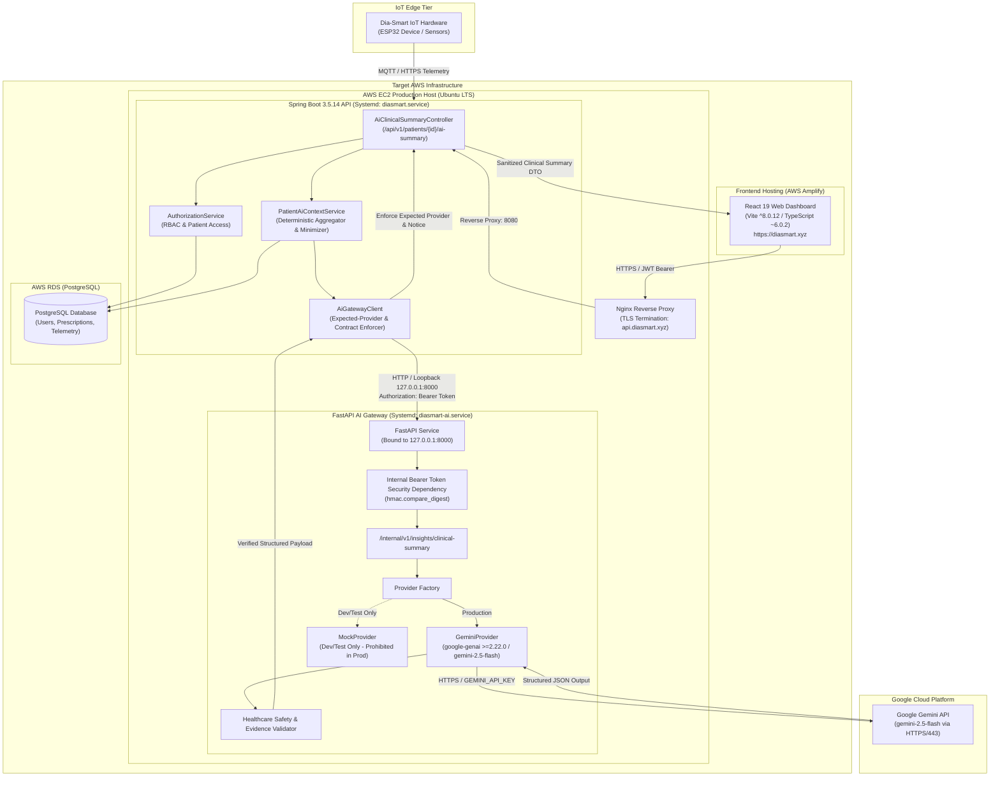

# Dia-Smart AI Integration: Final Architecture Specification

**Status:** Verified Local Implementation & Production Target Architecture  
**Release:** Part 7 — Production Readiness  
**Target Branch:** `ai-integration`  
**Date:** September 2026  

---

## 1. Executive Architecture Summary

Dia-Smart is an end-to-end IoT and cloud-based diabetes management platform that captures continuous and episodic biometric telemetry from patient hardware devices (ESP32-based glucometers and insulin management units) and delivers clinical management workflows to clinicians and patients via a modern web dashboard.

The AI subsystem provides automated, evidence-grounded, non-diagnostic clinical summaries to clinicians. The architecture is engineered with zero-trust isolation boundaries, strict multi-tier credential separation, deterministic data aggregation, loopback-only network containment, and server-enforced healthcare safety invariants.



---

## 2. Tiered System Topology & Service Boundaries

| Tier | Component | Technology & Actual Version | Network Ingress | Secrets Maintained | Secrets Denied |
|---|---|---|---|---|---|
| **Client** | Web Dashboard | React 19 (`react: ^19.2.6`), Vite (`^8.0.12`), TypeScript (`~6.0.2`), Tailwind CSS | Public Internet (`https://diasmart.xyz`) | User JWT Session Token | `GEMINI_API_KEY`, `AI_INTERNAL_SERVICE_TOKEN`, DB Credentials |
| **Edge** | Reverse Proxy | Nginx (Target Production Design) | Public Internet (`https://api.diasmart.xyz:443`) | SSL/TLS Certificates | All backend and AI credentials |
| **Backend** | Spring Boot API | Java 21, Spring Boot `3.5.14`, Hibernate | Loopback reverse proxy (`127.0.0.1:8080`) | DB credentials, JWT signing key, `AI_INTERNAL_SERVICE_TOKEN` | `GEMINI_API_KEY` |
| **AI Gateway** | AI Service | Python `>=3.11` (target `3.12`), FastAPI (`>=0.110.0`), Uvicorn (`>=0.28.0`), google-genai (`>=2.22.0`) | Strictly Loopback (`127.0.0.1:8000`) | `AI_INTERNAL_SERVICE_TOKEN`, `GEMINI_API_KEY` | DB credentials, JWT signing key, Patient PII |
| **Persistence** | Database | PostgreSQL (Local Dev & RDS Architecture) | Target: VPC Private Subnet (`5432`) | RDS Master / App Credentials | `GEMINI_API_KEY`, `AI_INTERNAL_SERVICE_TOKEN` |
| **External LLM** | Google Gemini | Google Gemini 2.5 Flash API | Outbound HTTPS (`generativelanguage.googleapis.com:443`) | Google API Authentication | System database, user tokens, internal tokens |

---

## 3. End-to-End Data & Execution Flow

### Step 1: User Request & Clinical Authorization
1. Clinician logs into React Web Dashboard and navigates to the Patient Clinical Workspace.
2. Clinician clicks **Generate AI Summary** or views the patient context.
3. React UI issues an authenticated HTTP `GET /api/v1/patients/{patientId}/ai-summary` request to the backend.
4. The request arrives with an `Authorization: Bearer <jwt_token>` header.
5. In production, Nginx forwards the request over `127.0.0.1:8080` to Spring Boot's [AiClinicalSummaryController](backend/spring-api/src/main/java/com/diasmart/springapi/ai/controller/AiClinicalSummaryController.java).
6. Spring Boot executes authorization checks via [AuthorizationService](backend/spring-api/src/main/java/com/diasmart/springapi/auth/service/AuthorizationService.java):
   - Confirms user identity and active session.
   - Enforces RBAC permissions: only clinicians (`DOCTOR`, `CLINICIAN`, `ADMIN`) assigned to the patient or patients viewing their own authorized data are permitted.
   - Any unauthorized access is rejected with `401 Unauthorized` or `403 Forbidden`.

### Step 2: Deterministic Data Extraction & Privacy Minimization
1. [PatientAiContextService](backend/spring-api/src/main/java/com/diasmart/springapi/ai/service/PatientAiContextService.java) queries PostgreSQL for the patient's record.
2. Spring Boot aggregates:
   - Recent blood glucose measurements (e.g., 24h, 7d, 30d): min, max, mean, time-in-range percentage, hypo/hyperglycemic event counts.
   - Active prescriptions and dosage schedules (medication names, target timings, dosage units).
   - Recent emergency/high-priority alerts.
3. **Privacy Minimization & Pseudonymization Gate:**
   - Patient names, emails, phone numbers, addresses, social security/national IDs, internal database primary keys, and device serial numbers are **strictly excluded**.
   - Only minimized, pseudonymized clinical context required for AI summarization is assembled into a strictly typed request payload.

### Step 3: Loopback Gateway Request & Internal Service Authentication
1. [AiGatewayClient](backend/spring-api/src/main/java/com/diasmart/springapi/ai/client/AiGatewayClient.java) serializes the clinical context.
2. Spring Boot issues an internal HTTP `POST http://127.0.0.1:8000/internal/v1/insights/clinical-summary`.
3. The request includes internal service-to-service bearer-token authentication:
   `Authorization: Bearer <AI_INTERNAL_SERVICE_TOKEN>`.
4. FastAPI's security dependency `verify_internal_token` in [internal_auth.py](ai-service/app/security/internal_auth.py) intercepts the request:
   - Validates the `Bearer` scheme.
   - Uses constant-time string comparison (`hmac.compare_digest`) to prevent timing attacks.
   - Rejects invalid, empty, or missing tokens with `401 Unauthorized`.

### Step 4: AI Provider Invocation & LLM Generation
1. In production (`AI_ENVIRONMENT=production`), [ProviderFactory](ai-service/app/providers/factory.py) selects [GeminiProvider](ai-service/app/providers/gemini_provider.py).
   - `MockProvider` is strictly prohibited in production; an attempt to configure it causes immediate startup failure.
2. `GeminiProvider` constructs a strict prompt enforcing:
   - Objective, factual clinical synthesis.
   - Grounded evidence citation based solely on declared context items.
   - Prohibition against prescribing, dosing adjustments, or diagnostic declarations.
   - Rigid JSON output schema matching `ClinicalSummaryResponse`.
3. FastAPI communicates with the Gemini API over HTTPS authenticated by `GEMINI_API_KEY`.

### Step 5: FastAPI Healthcare Safety & Evidence Validation
1. Upon receiving the LLM output, FastAPI validates the response through [medical_safety_validator.py](ai-service/app/validators/medical_safety_validator.py) and [evidence_validator.py](ai-service/app/validators/evidence_validator.py):
   - **Authoritative Safety Notice:** FastAPI verifies that the exact server-controlled notice is present:
     `"This AI-generated information is intended for review and does not provide a diagnosis, prescription, insulin-dosage recommendation, or treatment recommendation."`
   - **Fail-Closed Safety Validation:** If generated text contains diagnostic conclusions, prescriptive directives, or dosage instructions, **unsafe output is rejected** (raises `MedicalSafetyRejection`). The validator does not silently edit or strip unsafe instructions.
   - **Evidence Grounding Validation:** All required evidence references in observations and correlations must correspond to evidence supplied in the request. Fabricated or unknown references cause rejection.
2. FastAPI returns HTTP 200 with the structured JSON payload.

### Step 6: Spring Boot Defense-in-Depth Validation
1. `AiGatewayClient` receives the JSON response and deserializes it.
2. **Provider Mismatch Protection:**
   - Spring Boot verifies `response.getProvider().equalsIgnoreCase(expectedProvider)`.
   - In production (`AI_EXPECTED_PROVIDER=gemini`), if the response claims any other provider (e.g. `mock`), Spring Boot immediately rejects the response and throws `AiServiceException` (returning `502 Bad Gateway`).
3. **Safety Notice Verification:**
   - Validates that `safetyNotice` matches the exact authoritative safety text verbatim.
4. Returns the validated summary DTO to the controller.

### Step 7: Presentation in React Dashboard
1. The React Web Dashboard receives the JSON response and updates the UI state.
2. Displays:
   - Provider & Model badge.
   - Grounded clinical synthesis, observations with evidence tags, uncertainties, and discussion points.
   - Prominent, unmodifiable Amber Safety Banner displaying the exact server-controlled safety notice verbatim.
   - Clear disclaimer indicating clinician oversight is required.

---

## 4. Implementation Status vs. Production Deployment Design

To maintain strict technical accuracy, the system distinguishes between locally implemented/verified components and target production deployment requirements:

### Verified Locally / Implemented:
- **FastAPI Loopback Binding:** Configured and tested binding strictly to `127.0.0.1:8000`.
- **Production Guard:** Startup validation prohibiting `MockProvider` in production environment verified via automated tests and local startup tests.
- **Interactive Documentation Lockdown:** Disabling Swagger UI (`/docs`), ReDoc (`/redoc`), and OpenAPI schema (`/openapi.json`) in production verified via integration tests.
- **Spring Boot Alignment:** `application-prod.yml` configured with `expected-provider: ${AI_EXPECTED_PROVIDER:gemini}`.
- **Host Deployment Assets:** Systemd service unit template ([diasmart-ai.service](deploy/ai-service/diasmart-ai.service)), installation script ([install.sh](deploy/ai-service/install.sh)), and preflight validator ([check-config.sh](deploy/ai-service/check-config.sh)) implemented and tested.
- **Automated Test Suites:** 187 FastAPI tests passing, 192 Spring Boot tests passing, React build clean.

### Production Deployment Design / Target Requirements:
- **Network Containment:** In live EC2 hosting, FastAPI port 8000 must have no public ingress; Nginx must not route to FastAPI; AWS Security Groups must not expose port 8000.
- **Public Ingress:** Only intended public ports (80/443 to Nginx) should remain open.
- **Secrets Management:** Secrets must be injected into the production environment file (`/etc/diasmart/ai-service.env`, mode `0600`) from an approved secure vault (e.g., AWS Secrets Manager or Parameter Store).
- *Note:* No live AWS cloud deployment was executed during Part 7.

---

## 5. Trust Boundaries & Security Invariants

### Invariant 1: Loopback-Only AI Service Containment
- The FastAPI AI service binds strictly to `127.0.0.1:8000`.
- In the production target design, Nginx does not route any external path to port 8000, and AWS Security Groups deny all external traffic to port 8000.

### Invariant 2: Complete Separation of Credentials
- **React UI:** Holds zero AI credentials and cannot call FastAPI directly.
- **Spring Boot:** Knows `AI_INTERNAL_SERVICE_TOKEN`; has **no knowledge** of `GEMINI_API_KEY`.
- **FastAPI AI Service:** Knows `GEMINI_API_KEY` and `AI_INTERNAL_SERVICE_TOKEN`; has **no database credentials**, no JWT signing secrets, and no direct database connectivity.
- **Google Gemini API:** Sees only ephemeral prompt text containing pseudonymized metrics. Has no knowledge of Dia-Smart credentials, databases, or user identities.

### Invariant 3: Authoritative Server-Controlled Safety Notice
The legal and medical disclaimer cannot be generated, altered, or suppressed by the LLM:
```text
"This AI-generated information is intended for review and does not provide a diagnosis, prescription, insulin-dosage recommendation, or treatment recommendation."
```
Enforced redundantly across:
1. `ai-service/app/constants/safety.py`
2. `ai-service/app/validators/medical_safety_validator.py`
3. `backend/spring-api/src/main/java/com/diasmart/springapi/ai/validator/AiGatewayResponseValidator.java`
4. `frontend/web-dashboard/src/components/workspace/AiClinicalSummaryCard.tsx`

### Invariant 4: Production MockProvider Prohibition
In `production` environment (`AI_ENVIRONMENT=production`), the application refuses to start if `AI_PROVIDER=mock`.
Only `gemini` is permitted in production, ensuring test stubs never serve clinical users.

### Invariant 5: Emergency AI Kill-Switch
If the AI service experiences an anomaly, quota exhaustion, or security incident, administrators can instantly deactivate all AI functionality by setting:
`AI_ENABLED=false`
in Spring Boot's environment. Spring Boot immediately returns an informative disabled state without making any network calls to the AI subsystem.

---

## 6. Failure Modes & Graceful Degradation

| Failure Condition | Behavior & Recovery |
|---|---|
| **FastAPI Service Down (503/ConnectRefused)** | Spring Boot catches `RestClientException`, logs diagnostic details, and returns a clean `503 Service Unavailable` with `AI_SERVICE_UNAVAILABLE` code. React UI displays an inline alert with a manual retry button. |
| **Google Gemini Quota / 429 Rate Limit** | FastAPI catches quota errors and maps them to `503 Service Unavailable` with an informative error description. No secrets or internal stack traces are returned to the client. |
| **Token Mismatch / Security Probe** | FastAPI immediately returns `401 Unauthorized`. Spring Boot logs security warning. Request halts before LLM invocation. |
| **Provider Mismatch** | Spring Boot validates provider response against `AI_EXPECTED_PROVIDER`. If mismatched, discards payload and returns `502 Bad Gateway`. |
| **Unsafe or Malformed Output** | Safety or evidence validation fails; unsafe output is rejected (fail-closed, raising `MedicalSafetyRejection` or `EvidenceValidationError`), returning `502 Bad Gateway`. |
