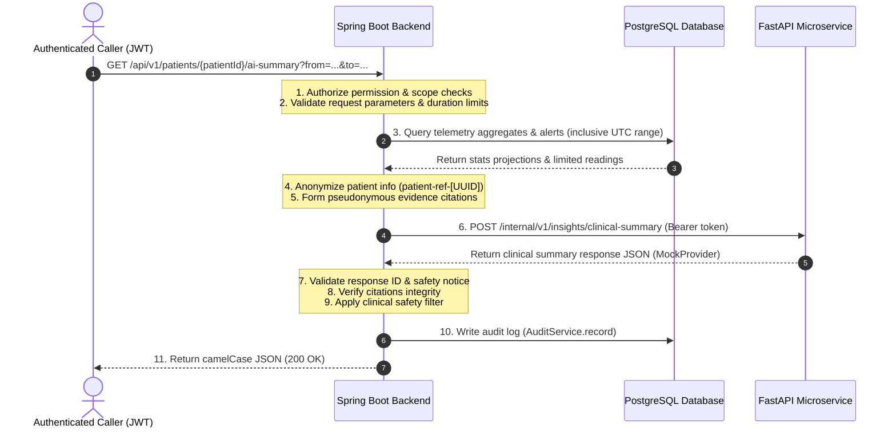

# Dia-Smart: AI-Assisted Clinical Insight Subsystem - Part 3 Implementation Report

This report documents the design, architecture, and verification of the secure Spring Boot backend integration slice connecting to the standalone FastAPI microservice (configured in mock mode).

---

## 1. Overview of the Architecture

The Dia-Smart Spring Boot backend acts as the secure, authenticated orchestrator that sits between clients (e.g. patients, clinicians) and the FastAPI AI service.



---

## 2. Configuration & Timeout Policies

AI features are configurable using environment variables and are mapped under the `diasmart.ai` property prefix.

### Application Properties Settings
- **`diasmart.ai.enabled`**: Set to `${AI_ENABLED:false}` (disabled by default to ensure the primary system starts without the dependency).
- **`diasmart.ai.gateway-url`**: Set to `${AI_GATEWAY_URL:http://127.0.0.1:8000}`.
- **`diasmart.ai.internal-service-token`**: Set to `${AI_INTERNAL_SERVICE_TOKEN:}`.
- **`diasmart.ai.connect-timeout`**: Set to `${AI_CONNECT_TIMEOUT:3s}`.
- **`diasmart.ai.read-timeout`**: Set to `${AI_READ_TIMEOUT:30s}`.
- **`diasmart.ai.max-date-range-days`**: Set to `${AI_MAX_DATE_RANGE_DAYS:31}` (limits request period).
- **`diasmart.ai.max-alerts`**: Set to `${AI_MAX_ALERTS:100}` (caps alert items passed to AI).
- **`diasmart.ai.max-selected-events`**: Set to `${AI_MAX_SELECTED_EVENTS:100}` (caps timeline context events).

*Note: Timeout policies are enforced directly at the bean initialization level using Spring's `SimpleClientHttpRequestFactory` configured on the shared `RestClient`.*

---

## 3. Data Aggregation & Minimization

The system aggregates telemetry records while aggressively minimizing data exposed to the microservice:

1. **Anonymization**:
   - Patient names, contact info, and internal database primary keys are stripped.
   - The patient is represented via a request-scoped pseudonymous reference: `"patient-ref-" + UUID.randomUUID()`.
   - Telemetry events (glucose, storage temperature, alerts, doses) are referenced pseudonymously using opaque tokens (e.g. `glucose-reading:id-[ID]`).

2. **Domain-Specific Aggregation**:
   - **Glucose**: High and low thresholds are read dynamically from the patient's record (`targetGlucoseMinMgDl`/`targetGlucoseMaxMgDl`). If absent, they default to `70.0` and `180.0` mg/dL.
   - **Adherence**: Evaluated daily using schedule windows. Late and missed counts are clamped to ensure they satisfy mathematical constraints (`recorded_administrations <= scheduled_administrations`, `delayed_administrations + missed_administrations <= scheduled_administrations`).
   - **Storage**: Storage excursions are counted when the storage temperature falls outside `2.0°C - 8.0°C` refrigeration bounds.
   - **Inventory**: Fetched from the latest inventory reading on or before the end of the period, counting low and critical inventory levels.

3. **Event Timeline Selection**:
   - Timeline events are programmatically selected and populated using structured numeric/status fields, omitting free-text comments or patient-supplied notes.
   - The timeline is sorted chronologically and capped at the configured limit.

---

## 4. Verification Layers & Security Filters

We implemented a defense-in-depth safety design at the Spring Boot orchestration boundary:

1. **Authorization**:
   - Requests require a valid Bearer token.
   - Permission check `Permission.READ_PATIENT_READINGS` is evaluated by `AuthorizationService`.

2. **Validation**:
   - Date parameters must be timezone-aware ISO-8601 strings. Naive datetimes (without offsets) are rejected with a `400 Bad Request` (`INVALID_PERIOD`).
   - Request and response IDs are matched to prevent request hijacking.
   - The safety notice disclaimer is verified against the `APPROVED_SAFETY_NOTICE` exactly.

3. **Clinical Safety Filter**:
   - Response summary and statement text are scanned against regular expression patterns representing prohibited clinical instructions (direct diagnosis claims, dosage adjustments, or prescription change commands).
   - Any validation failure throws a `400 Bad Request` or `502 Bad Gateway` (`AI_INVALID_RESPONSE`), discarding the invalid response safely.

---

## 5. Audit Logging

On successful clinical summary generation, the system records the event to:
- **SLF4J Structured Logs**: Logging request IDs, patient references, date boundaries, and microservice execution times.
- **Audit Log Database**: Calling the existing database `AuditService.record()` method with detailed transaction metadata.

---

## 6. Security Warnings & Pre-existing Issues

> [!WARNING]
> **Pre-existing Committed Production Secrets Warning**
> During the configuration audit, we identified that production PostgreSQL database credentials (`Sanjeevan2002`) and JWT secrets (`diasmart_super_secure_local_jwt_secret_123456`) are committed directly to `application-prod.yml`.
> 
> Consistent with the read-only constraints of Part 3, these values have NOT been modified or exposed. However, it is strongly recommended that these values be externalized via environment variables (e.g. `${DB_PASSWORD}`) prior to deployment.

---

## 7. Verification Results

### Automated Tests
We added a comprehensive suite of unit and integration tests under `backend/spring-api/src/test/java/com/diasmart/springapi/ai/`:
- [AiGatewayResponseValidatorTest](file:///d:/3YP/e21-3yp-dia-smart/backend/spring-api/src/test/java/com/diasmart/springapi/ai/validation/AiGatewayResponseValidatorTest.java): Asserts request matching, safety notice checks, citation tracking, and safety filters.
- [AiGatewayClientTest](file:///d:/3YP/e21-3yp-dia-smart/backend/spring-api/src/test/java/com/diasmart/springapi/ai/client/AiGatewayClientTest.java): Asserts client HTTP timeout mapping and error status code translation.
- [PatientAiContextServiceTest](file:///d:/3YP/e21-3yp-dia-smart/backend/spring-api/src/test/java/com/diasmart/springapi/ai/service/PatientAiContextServiceTest.java): Asserts data aggregation logic, pseudonymous ref generation, and insufficient data checking.
- [AiClinicalSummaryControllerTest](file:///d:/3YP/e21-3yp-dia-smart/backend/spring-api/src/test/java/com/diasmart/springapi/ai/controller/AiClinicalSummaryControllerTest.java): Asserts controller response status codes (503 on disabled, 400 on naive periods, 200 on successful requests).

### Test Suite Execution Output
All 141 tests pass successfully:
```bash
[INFO] Results:
[INFO] 
[INFO] Tests run: 141, Failures: 0, Errors: 0, Skipped: 0
[INFO] 
[INFO] ------------------------------------------------------------------------
[INFO] BUILD SUCCESS
[INFO] ------------------------------------------------------------------------
```
